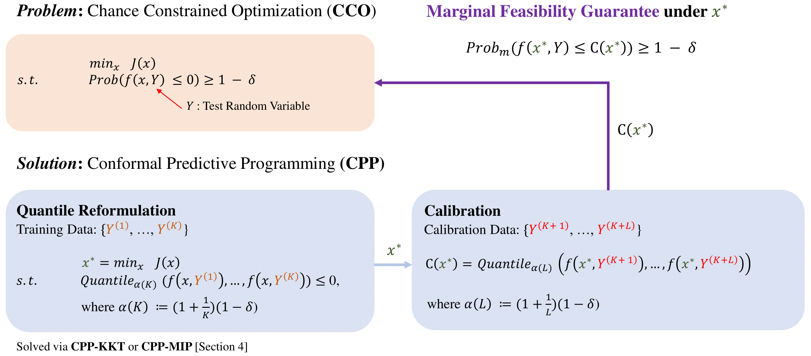

# Conformal-Predictive-Programming-for-CCO
## Overview
This repository contains the implementation of [Conformal Predictive Programming for Chance Constrained Optimization](https://arxiv.org/pdf/2402.07407.pdf). We will walk you through how to use the codes in this repository for your own project and how the implementations for the case studies in the paper are structured. Below is the abstract of the paper:

Motivated by the advances in conformal prediction (CP), we propose conformal predictive programming (CPP), an approach to solve chance constrained optimization (CCO) problems, i.e., optimization problems with nonlinear constraint functions affected by arbitrary random
parameters. CPP utilizes samples from these random parameters along with the quantile lemma – which is central to CP – to transform the CCO problem into a deterministic optimization problem. We then present two tractable reformulations of CPP by: (1) writing the quantile as a linear program along with its KKT conditions (CPP-KKT), and (2) using mixed integer programming (CPP-MIP). CPP comes with marginal probabilistic feasibility guarantees for the CCO problem that are conceptually different from existing approaches, e.g., the sample approximation and the scenario approach. While we explore algorithmic similarities with the sample approximation approach, we emphasize that the strength of CPP is that it can easily be extended to incorporate different variants of CP. To illustrate this, we present robust conformal predictive programming to deal with distribution shifts in the uncertain parameters of the CCO problem. 

<table cellpadding="0" cellspacing="0" border="0" width="100%">
<tr><td align="center">

</td></tr>
</table>

## Conformal Predictive Programming
The codes for the solvers are included in the `resources` folder. Please change the corresponding configuration file for your own system path. One can access the solvers through the `solve` function provided in `resources/solver.py`. The `solve` function takes in the following arguments and follows the representation in Equation (3) of the paper:

- x_dim: The dimension of the decision variable x. Acceptable argument is either an integer in the case when x is a scalar or a vector or a size 2 tuple in the case when x is a matrix (see case study 2).
- delta: the expected miscoverage rate.
- training_Ys: the training data $Y^{(1)}, ..., Y^{(K)}$.
- hs: the list of deterministic inequality constraint functions, which should be a functions of x only. The definition follows equation (3) from the paper (where the functions will be upper bounded by 0).
- gs: the list of deterministic equality constraint functions, which should be a functions of x only. The definition follows equation (3) from the paper (where the functions will be equal to 0).
- f: the chance constraint function. It should be a function of x in the first argument and Y in the second argument. Alternatively, this can be a list of functions in the case of JCCO (Note this requires that the function constraints satisfy simultaneously.
- J: the cost function, which should be a function of x only.
- method: The method used for solving the cco. The acceptable method includes "SA" (for scenario approach), "SAA" (for sample average approach), "CPP-KKT", and "CPP-MIP". Only "CPP-KKT" and "CPP-MIP" are allowed when robust is marked true and when the joint_method is not None.
- omega: the expected miscoverage rate for SAA.
- robust: a boolean value indicating if the chance constraint encoding is robust.
- epsilon: the distribution shift handeled by the robust encoding (in KL divergence).
- joint_method: the method used for encoding the joint chance constraint. The acceptable methods include "Union" and "Max".

The function will return the solution in its first position and the solving time in the second. To illustrate how to use the solver, we provide several examples in `resources/examples`. In `example_cco.py`, we demonstrate how to solve case study 1 from the paper with K = 100. In `example_rcco.py`, we robustify the previous example with a small $\epsilon$. We also show how to use the solver to solve the problem in the case study for JCCO from the paper with K = 20.

## Case Studies
The implementation of the case studies is included in the `case_studies` folder, which one can run to reproduce the results in the paper for case study 1, case study 2 (the optimal control problem), case study 3 (the portfolio optimization problem), and case study 4 (the JCCO problem). The resulting data will be stored in `case_studies_results`. To reproduce the plots in the paper, one can run the python files in `case_studies_plotters`, which will reproduce the plots in `case_studies_plots`.

When running the codes, please change the corresponding configuration file for your own system path. We remark that we made the following changes that make the results different than what we have in the paper:

- We included a seed that changed the results from what we present in the paper.
- We increased K from 70 to 75 for the second case study.
- We decreased K from 80 to 75 for the third case study.

## Acknowledgement
We would like to thank our friend Yu Chen for the valuable discussions regarding the scenario approach.

## Contact Information
[Yiqi (Nick) Zhao](https://zhaoy37.github.io/) and [Xinyi Yu](https://xinyi-yu.github.io/) are PhD students for Computer Science at the University of California. For any questions or suggestions, please feel free to contact us at yiqizhao@usc.edu or xinyi.yu12@usc.edu.
